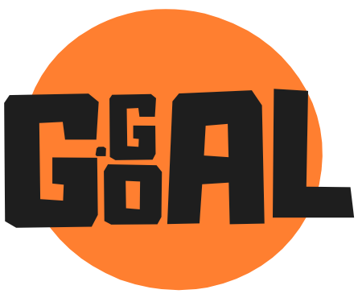

# GoGoaGoal ⚽🏆



Welcome to **GoGoaGoal**, the ultimate web platform for managing all the needs of a futsal arena! 🥅🎉

## Overview

GoGoaGoal is a comprehensive futsal arena management web application designed to streamline your operations and enhance the user experience. Whether you're booking a futsal match or managing daily reports, GoGoaGoal has got you covered! 🌟

## Features

- **Futsal Booking 📅**
  - Easily book futsal matches with a user-friendly interface.

- **Clean UI Admin Dashboard 📊**
  - Get daily reports and insights at a glance.

- **Checkout and Invoice 💸**
  - Seamless checkout process with detailed invoices.

- **Expenditure Tracker 📈**
  - Keep track of all your expenditures effortlessly.

- **Staff Management 👥**
  - Manage your staff with ease.

- **Profit and Loss Reports 💹**
  - Generate detailed profit and loss reports.

- **Expenditure Reports 💰**
  - Stay on top of your spending with comprehensive expenditure reports.

- **Booking Reports 📝**
  - Keep a record of all bookings with detailed reports.

## User Experience

GoGoaGoal is designed with a simple and nice UI for a better user experience. Navigate through the platform with ease and enjoy a seamless management experience. 😎👍

## Preview

Here's a sneak peek of what GoGoaGoal looks like:


##### Just a dashboard here will soon host on completion.

## Getting Started

To get started with GoGoaGoal, follow these steps:

1. **Clone the repository**
    ```bash
    git clone https://github.com/nischhal-hub/GoGoaGoal.git
    ```

2. **Navigate to the project directory**
    ```bash
    cd gogoagoal
    ```

3. **Set up your local server**
    - Make sure you have PHP and a local server environment like XAMPP, WAMP, or MAMP installed.

4. **Copy the project files to your server's root directory**
    - For XAMPP, it would be `C:/xampp/htdocs/gogoagoal` if linux `/opt/lampp/htdocs`.
    - For MAMP, it would be `/Applications/MAMP/htdocs/gogoagoal`.

5. **Create a database**
    - Use phpMyAdmin or any database management tool to create a database for GoGoaGoal.

6. **Import the database**
    - Import the provided SQL file (e.g., `/conn/schema.sql`) into your newly created database.

7. **Configure the application**
    - Update the database configuration in the `/conn/conn.php` file with your database credentials.

8. **Run the application**
    - Open your web browser and navigate to `http://localhost/gogoagoal`.

## Contributing

We welcome contributions to make GoGoaGoal even better! Feel free to submit issues and pull requests. 🎉

## License

This project is licensed under the MIT License. See the [LICENSE](LICENSE) file for details.

---

Made with ❤️ by Nischhal😁👋
